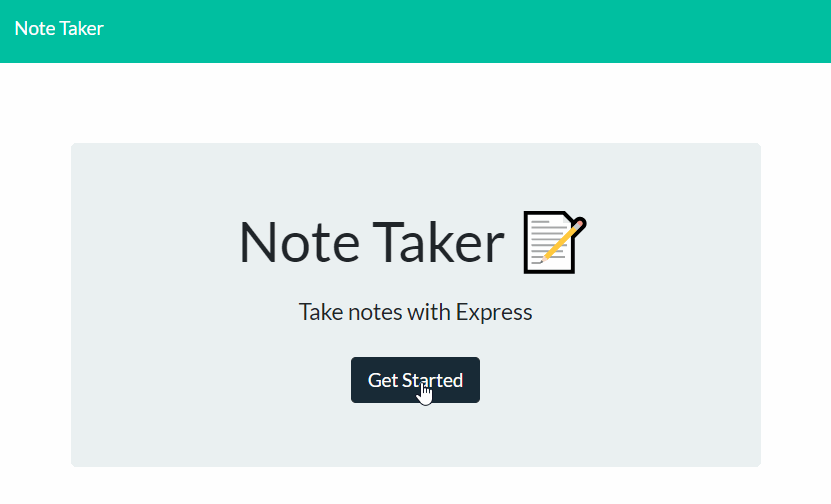
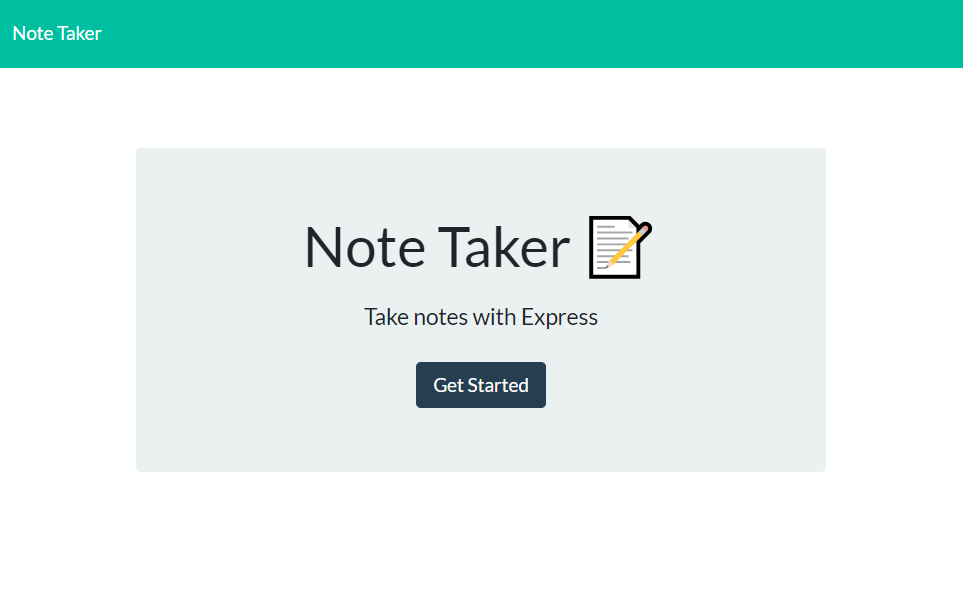
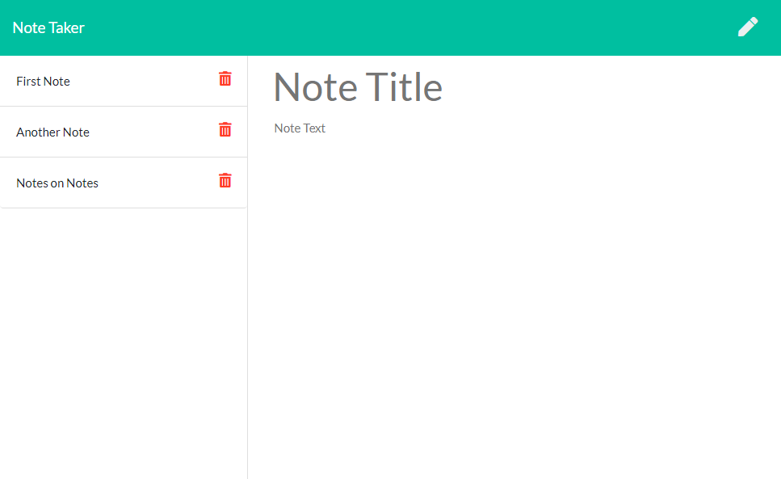

# Express Note Taker
Note taker created using express. This repository is used for a homework assignment as part of a web dev bootcamp.

## Description 
Note Taker app used primarily for practice using express.js and Heroku for the first time. Allows the user to save a note, view the old notes, and delete notes, which are saved on a server ran on Heroku. Majority of html, css, and front end js provided with the homework.

## Live App
https://dashboard.heroku.com/apps/note-taker-heroku-practice

## Images
GIF demonstrating the Note Taker app in action.

Image of the initial view when you visit the app.

Image of the note taking page.

## Installation 
Keep all files in a single folder and do not move files around within the folder. Can be run on a locally created server by installing all the dependancies, or installed on a server. You must also have node.js and perform a npm install to bring in all the necessary node modules. Use server.js as the file to initialize the app.

## Usage 
This was primarily made to meet the requirements of a homework assignment. You could use this as a basic app to save notes. The danger is that there is no current real database. It just saves to db.json. Potentially a good starting point for building a full note taking app.

## Credits 
I created this code based on the homework prompt created by Triology Education Services. Certain pieces of code I used online resources for help. As stated above, a good portion of the html, css, and index.js code was provided with the homework. I have included citations in the form of comments throughout the html, javascript, and css.

## Contributing 
I was the only one to work on this project, but of course I had help from my instructor, TA's, and classmates.

## Challenges
Most challenges revolved around getting code to work on a local server and on heroku for the first time. The homework instructions did not mention anything about static files and I do not remember covering static files in class. Since I did not add anything about static files in my early testing of server.js, I continued to run into page breaking errors. I initially thought this was due to running the server on my computer as opposed to on Heroku. I changed the paths in the index.html and note.html files and wrote some odd code that changed the gets when PORT was equal to 3000. When I later moved my code to Heroku I ran into similar issues. I finally did some google searching and learned about dealing with static files and methods express had to address this issue. A little later I realized that not only did this solve my issue when running on Heroku, but this was the issue I was dealing with early on when trying to run the code for the first time. It had nothing to do with a server ran on my computer vs Herkou.

## License
[MIT](https://choosealicense.com/licenses/mit/)